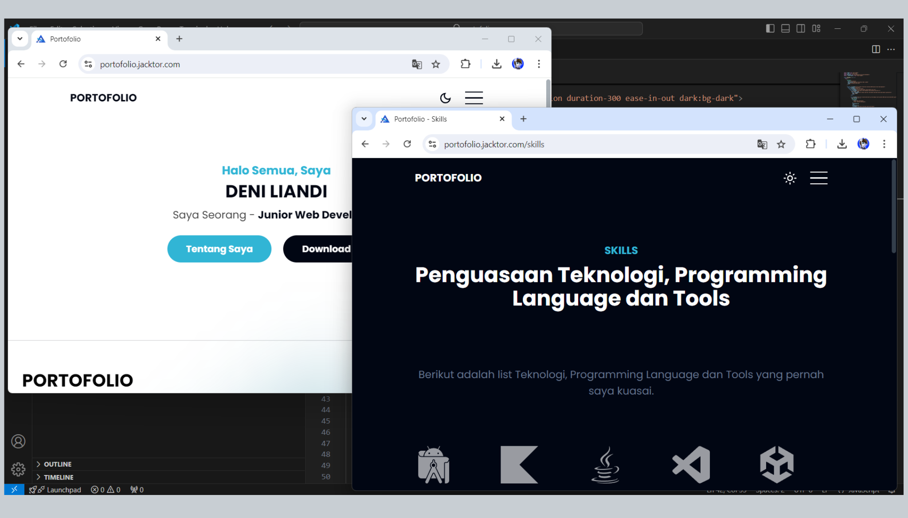

<h1 align="center">Web Portofolio</h1>
<p align="center">Repository ini merupakan web portofolio yang saya buat menggunakan teknologi NextJS dan Tailwind CSS</p>



## Daftar Isi

- [Menjalankan di Localhost](#menjalankan-di-localhost)
- [List NextJS API](#list-nextjs-api)

## Menjalankan di Localhost

- Clone repository ini

```bash
git clone --depth=1 https://github.com/jacktor-stan/portofolio
```

- Instal dependency library

```bash
cd portofolio && npm install
```

- Copy file `.env.example` ke file `.env.local`

```bash
cp .env.example .env.local
```

- Isikan `.env.local`

```bash
NEXT_PUBLIC_BASE_URL="http://localhost:3000"
NEXT_PUBLIC_PUBLIC_ASSETS="$NEXT_PUBLIC_BASE_URL/images/posts/assets"
```

- Menjalankan di development

```bash
npm run dev
```

## List NextJS API

| Endpoint          | Method |
| ----------------- | ------ |
| `/api/menu`       | GET    |
| `/api/portofolio` | GET    |